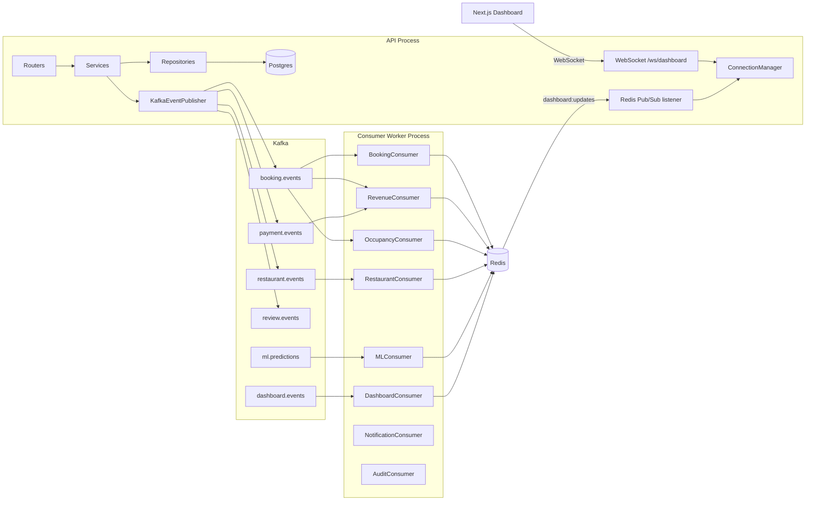
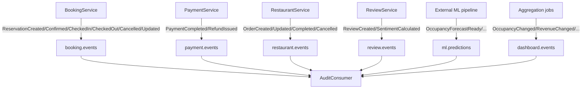
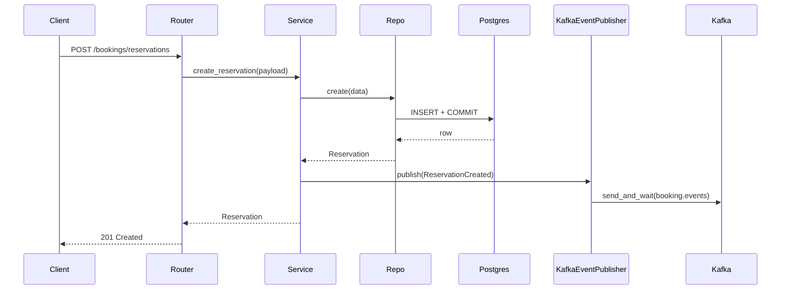
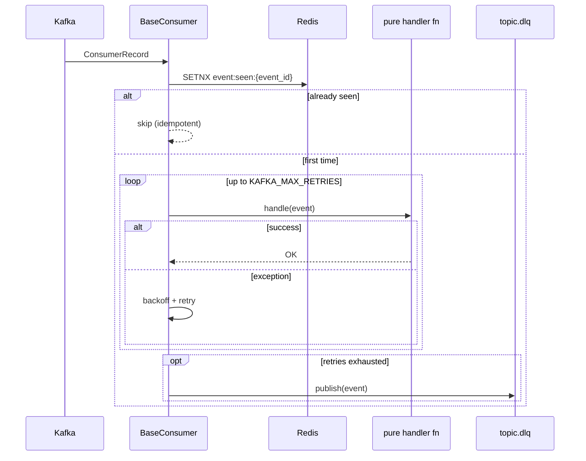
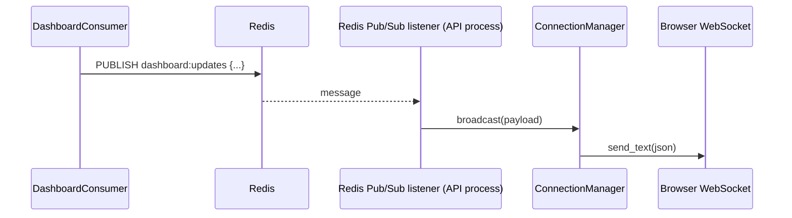
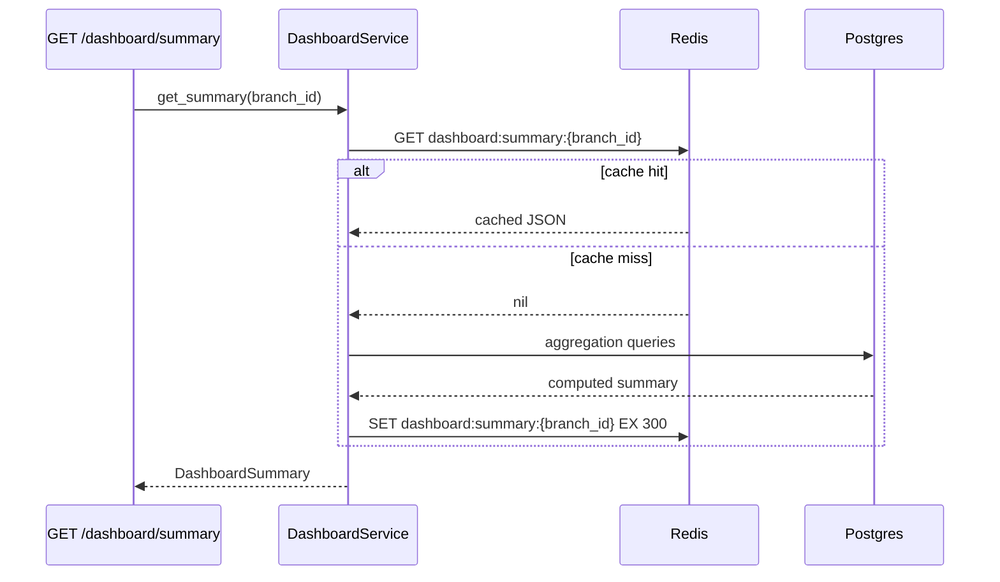
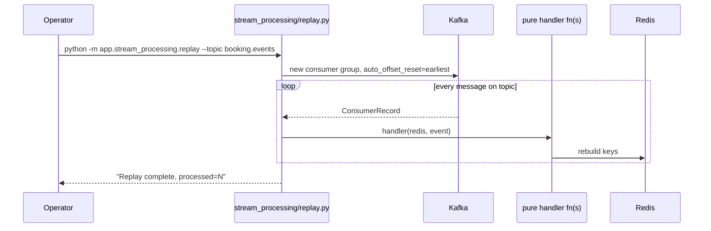

# Sequence Diagrams

## System architecture

```mermaid
flowchart LR
    subgraph API Process
        R[Routers] --> S[Services]
        S --> Repo[Repositories]
        Repo --> PG[(Postgres)]
        S --> P[KafkaEventPublisher]
        WS[WebSocket /ws/dashboard] --> CM[ConnectionManager]
        Bridge[Redis Pub/Sub listener] --> CM
    end

    subgraph Kafka
        T1[booking.events]
        T2[payment.events]
        T3[restaurant.events]
        T4[review.events]
        T5[ml.predictions]
        T6[dashboard.events]
    end

    subgraph Consumer Worker Process
        C1[BookingConsumer]
        C2[RevenueConsumer]
        C3[OccupancyConsumer]
        C4[RestaurantConsumer]
        C5[MLConsumer]
        C6[DashboardConsumer]
        C7[NotificationConsumer]
        C8[AuditConsumer]
    end

    P --> T1
    P --> T2
    P --> T3
    P --> T4

    T1 --> C1
    T1 --> C2
    T1 --> C3
    T2 --> C2
    T3 --> C4
    T5 --> C5
    T6 --> C6

    C1 --> Redis[(Redis)]
    C2 --> Redis
    C3 --> Redis
    C4 --> Redis
    C5 --> Redis
    C6 --> Redis
    Redis -- dashboard:updates --> Bridge

    Next[Next.js Dashboard] -- WebSocket --> WS
```

## Kafka topics

```mermaid
flowchart TD
    Booking[BookingService] -->|ReservationCreated/Confirmed/CheckedIn/CheckedOut/Cancelled/Updated| BT[booking.events]
    Payment[PaymentService] -->|PaymentCompleted/RefundIssued| PT[payment.events]
    Restaurant[RestaurantService] -->|OrderCreated/Updated/Completed/Cancelled| RT[restaurant.events]
    Review[ReviewService] -->|ReviewCreated/SentimentCalculated| RVT[review.events]
    ML[External ML pipeline] -->|OccupancyForecastReady/...| MLT[ml.predictions]
    Agg[Aggregation jobs] -->|OccupancyChanged/RevenueChanged/...| DT[dashboard.events]

    BT & PT & RT & RVT & MLT & DT --> Audit[AuditConsumer]
```

## Producer flow

```mermaid
sequenceDiagram
    participant Client
    participant Router
    participant Service
    participant Repo
    participant DB as Postgres
    participant Pub as KafkaEventPublisher
    participant Kafka

    Client->>Router: POST /bookings/reservations
    Router->>Service: create_reservation(payload)
    Service->>Repo: create(data)
    Repo->>DB: INSERT + COMMIT
    DB-->>Repo: row
    Repo-->>Service: Reservation
    Service->>Pub: publish(ReservationCreated)
    Pub->>Kafka: send_and_wait(booking.events)
    Service-->>Router: Reservation
    Router-->>Client: 201 Created
```

## Consumer flow

```mermaid
sequenceDiagram
    participant Kafka
    participant Consumer as BaseConsumer
    participant Redis
    participant Handler as pure handler fn
    participant DLQ as topic.dlq

    Kafka->>Consumer: ConsumerRecord
    Consumer->>Redis: SETNX event:seen:{event_id}
    alt already seen
        Consumer-->>Consumer: skip (idempotent)
    else first time
        loop up to KAFKA_MAX_RETRIES
            Consumer->>Handler: handle(event)
            alt success
                Handler-->>Consumer: OK
            else exception
                Consumer->>Consumer: backoff + retry
            end
        end
        opt retries exhausted
            Consumer->>DLQ: publish(event)
        end
    end
```

## WebSocket flow

```mermaid
sequenceDiagram
    participant Dashboard as DashboardConsumer
    participant Redis
    participant Bridge as Redis Pub/Sub listener (API process)
    participant Manager as ConnectionManager
    participant Client as Browser WebSocket

    Dashboard->>Redis: PUBLISH dashboard:updates {...}
    Redis-->>Bridge: message
    Bridge->>Manager: broadcast(payload)
    Manager->>Client: send_text(json)
```

## Redis cache flow

```mermaid
sequenceDiagram
    participant Router as GET /dashboard/summary
    participant Service as DashboardService
    participant Redis
    participant DB as Postgres

    Router->>Service: get_summary(branch_id)
    Service->>Redis: GET dashboard:summary:{branch_id}
    alt cache hit
        Redis-->>Service: cached JSON
    else cache miss
        Redis-->>Service: nil
        Service->>DB: aggregation queries
        DB-->>Service: computed summary
        Service->>Redis: SET dashboard:summary:{branch_id} EX 300
    end
    Service-->>Router: DashboardSummary
```

## Replay flow

```mermaid
sequenceDiagram
    participant Operator
    participant Replay as stream_processing/replay.py
    participant Kafka
    participant Handler as pure handler fn(s)
    participant Redis

    Operator->>Replay: python -m app.stream_processing.replay --topic booking.events
    Replay->>Kafka: new consumer group, auto_offset_reset=earliest
    loop every message on topic
        Kafka-->>Replay: ConsumerRecord
        Replay->>Handler: handler(redis, event)
        Handler->>Redis: rebuild keys
    end
    Replay-->>Operator: "Replay complete, processed=N"
```
